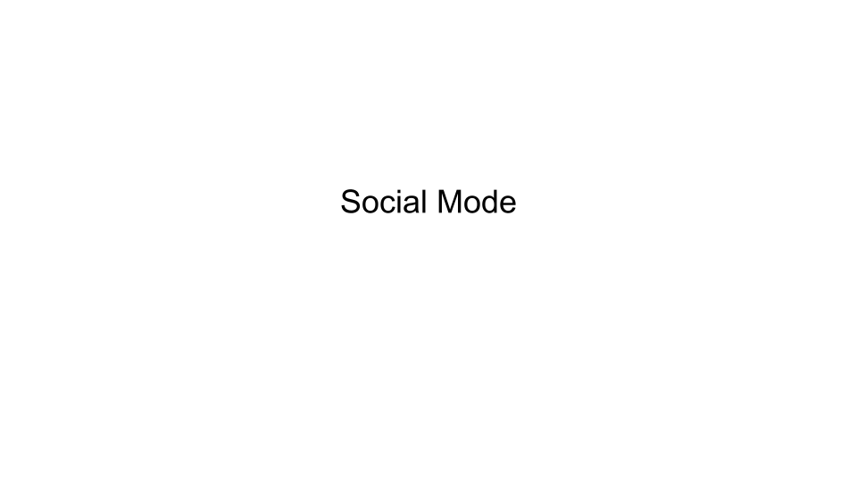
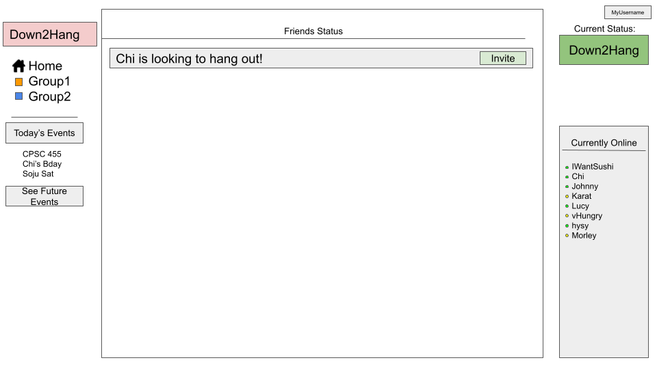
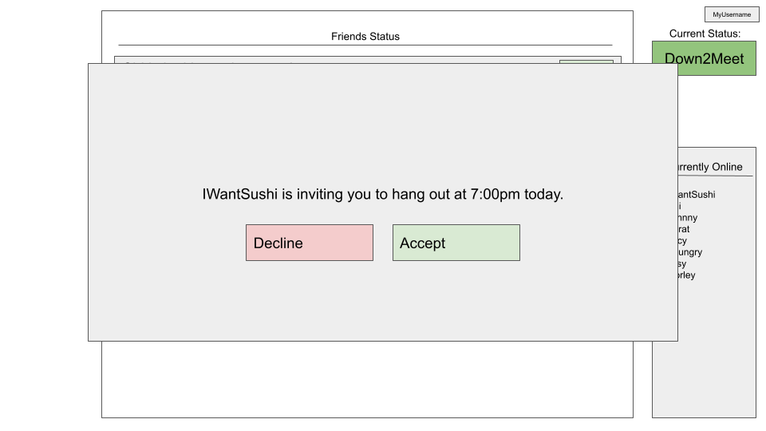
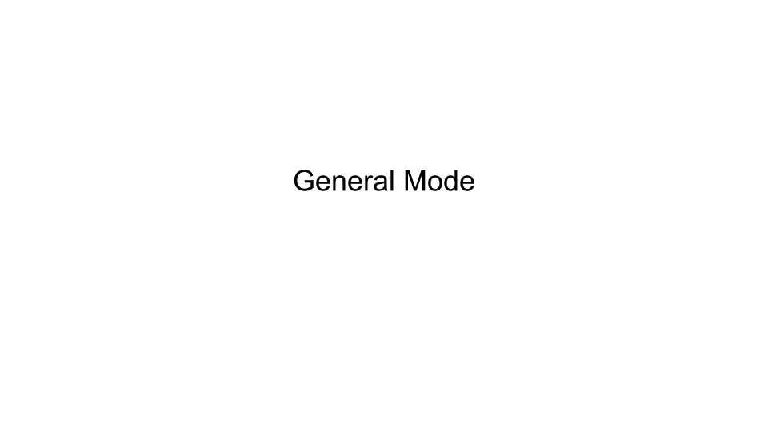
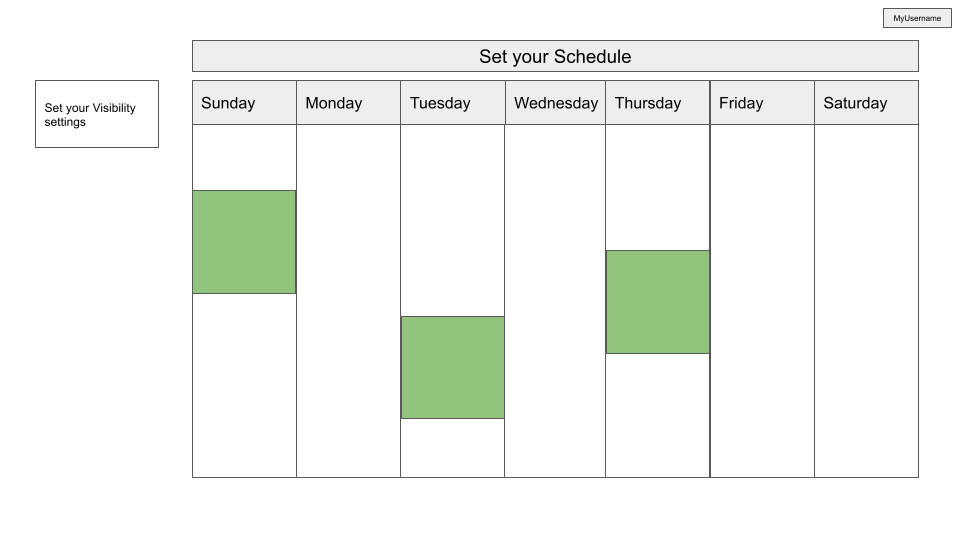
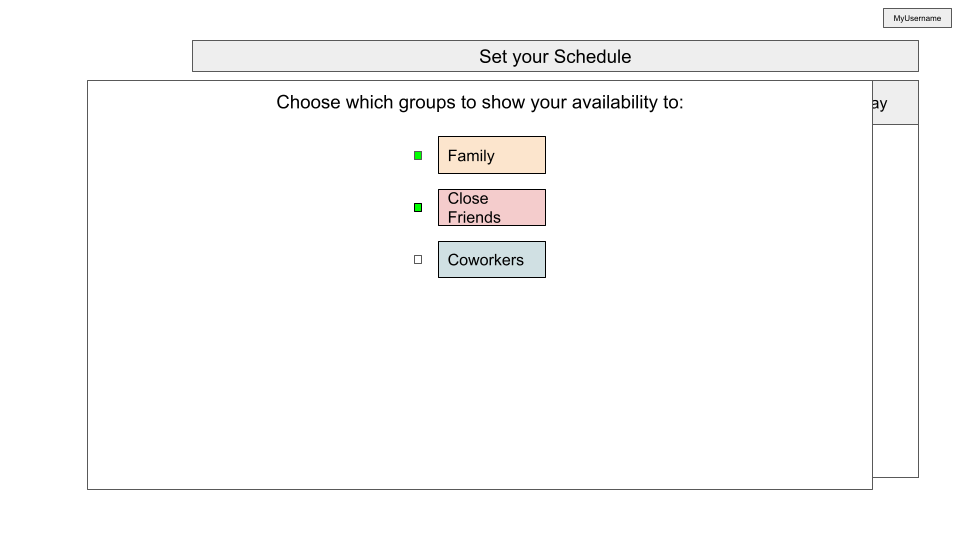
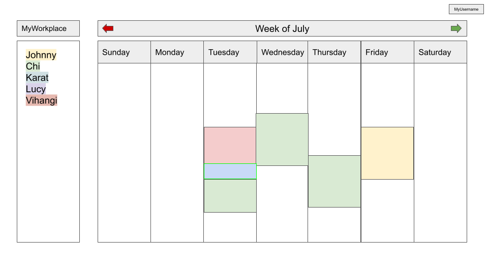

# down2meet

## Description
Down2meet is a solution for scheduling hangouts with friends. It gives users the ability to effortlessly organize and plan meet-ups while also fostering an engaging social networking experience within the platform. It eliminates the hassle of back-and-forths of group chat confusion by easily being able to request and accept hangouts and view when your friends are free to hangout

## Goals
3-5 minimal requirements (will definitely complete)
> - [x] Create an account (set up profile)
> - [x] Log into the account
> - [x] Add/remove friend 
> - [x] Share availability 
> - [x] View planned activities
> - [x] Request/confirm a hangout

3-7 "standard" requirements (will most likely complete) 
> - [x] Filter friends based on availability
> - [x] System saves the user’s default schedule times (fixed schedule ie. work hours) 
> - [ ] System announcement of the availability and meet-up requests - Will not complete as it’s not fit for a website
> - [x] Create a friend group
> - [x] User can select who gets shown their availability

2-3 stretch requirements (plan to complete at least 1!)
> - [ ]  Allowing users to upload/update their schedule
> - [ ] Using an API to upload their schedule from UBC, Google Calendar, etc. 
> - [x] Sync events committed on the App to the user’s personal Google account (Google token for sign up may help with it); schedule changes made on the app would be reflected on their Google Calendar
> - [ ]  Request meeting change -> WILL MEET (Can do so by chatting with the system and having it broadcast the request to the other members of the group)
> - [ ]  Change language of the whole webapp (User can select the language of the webapp)
> - [ ] Log into different accounts, Select which account(s) to display schedule from (ie. work account, personal account)

## Usage of Tech from Units 1-5

- Unit 1: HTML/CSS/Javascript
> We used HTML/CSS to build the front end of our site. HTML for the structure of the site was often written in JSX code which enabled us to write in Javascript and 

- Unit 2:  React & Redux
> We used React and Redux to create a dynamic and responsive user interface. By utilizing React's component-based architecture, we modularized our application and facilitated seamless updates. Redux centralized our state management, ensuring consistent data flow and enabling efficient communication between components. Together, React and Redux enabled us to build a scalable and organized frontend that enhances user experience and simplifies complex data interactions.

- Unit 3: NodeJS & Express
> We used NodeJS and Express to build the server side and allow for communication between the client and server side. NodeJS allows writing Javascript on the server side, and Express simplifies the process of handling API requests, routing, and middleware. We used these technologies whenever we have to fetch or update data not directly stored in the front end.

- Unit 4: NoSQL with MongoDB
> We used MongoDB, the NoSQL database, to store and manage all project-related data. The flexibility of NoSQL allowed us to model the data in a schema-less manner, making it easy to adapt and scale as the project evolved. MongoDB provided efficient storage of complex data structures and fast and reliable access to information, enhancing overall performance.

- Unit 5: Deployment
> We used Render.com to deploy our site with seamless integration with Github. It allows access to the site on other devices.

## Above and Beyond Functionality
The above and beyond functionality for our site was using external APIs and libraries. The login functionality uses Google OAuth. This feature allows users to log in using their Google accounts, making the registration and login process more convenient for them. We also integrated Google Calendar API so events created or joined through the website automatically get added to the user’s Google Calendar. This feature makes keeping track of events easier for the users, but they can also opt not to connect to their Google Calendar

## Next steps
To further improve the app, we wanted to add more functionality that would make our app be more practical in its use, such as improving on the privacy settings or creating a Notifications feature that many popular social media sites use at the moment. We also want a user to be able to restrict posts and their availability to a particular group and also be able to compare a groups common availability. As an extra stretch goal, turning this app into a mobile app would also make it much more practical for the concept of our project.

## Contributions

- Johnny Lau
> Worked on all the styling of the site, as well as the overall project structure of the front-end, UI/UX design, and managed the redux. Handled the implementation of the Home page with the Social feed and Hangouts page, and worked on many of the bugs related to the back-end requests.

- Lucy Li
> Worked on the login functionality and user authentication system. Implemented features such as displaying posts exclusively for friends and enabling post deletion by users. Handled and fixed bugs for backend requests for other functionalities across the site. Implemented the use of local storage enhanced user experience and streamlined data management.

- Karat Wannissorn
> Worked on the profile page, allowing users to edit their information, and some styling on the Availability page. Also worked on event synchronization so that events created/joined on the Home page gets added to the calendar in Profile page and Events page as well as Google Calendar, while events that are deleted get removed from the calendar.

- Vihangi Perera
> Worked on configuring Mongo DB and also deploying the website on Render and came up with initial project idea. Implemented features like the search bar, the ability to add and delete friends, and allowing users to show availability to selected friends. Also implemented availability status, as well as filtering friends based on their availability status. 

- Chinenye Oluka
> Worked on populating the app’s calendar with events and designing a detailed view of the events when an event is clicked on the Availability page, but keeping the event details hidden profile viewers in the profile page Also implemented the ability to add friends to a group, display the friends in a group on the Groups page, and to display the existing groups on the Availability page.

Group Name: 
**down2meet**

Group Members:
- Johnny Lau
- Chinenye Oluka
- Lucy Li
- Karat Wannissorn
- Vihangi Perera

## Project Description
Write 3-5 sentences on your project topic. Who is it for? What will it do? (What "human activity" will it support?) 
> This app is for a group of people who often need to select a meeting time when all members of the group are available. This will enable them to automatically see which day will be ideal for a meet-up without having to have a prolonged conversation and sequentially go through all potential dates.

>There will be ...
> - An events tab that has your confirmed hangouts.
> - A feed that has everyone’s availability, where you can filter by day/time etc. 
> - A "Hang Now" tab, where you can request and see immediate meet-up requests

What type of data will it store? 
> - User accounts 
> - Schedules 
> - Activities

What will users be able to do with this data? 
> Users can friend other users, and choose who can see their meet-up requests and schedule (ie. family, close friends)
> Users can see their own schedule and friends’ schedules
> Users can see their planned activities and friends' activities

What is some additional functionality you can add/remove based on time constraints? 
> Include the option to select professional or casual mode (work  v.s. fun mode)

## Project task requirements
3-5 minimal requirements (will definitely complete)
> - [x]  Create account (set up profile)
> - Log into account
> - Add/remove friend 
> - Share availability 
> - View planned activities
> - Request/confirm a hangout

3-7 "standard" requirements (will most likely complete) 
> - Filter friends based on availability
> - System saves the user’s default schedule times (fixed schedule ie. work hours) 
> - System announcement of the availability and meet-up requests
> - Create friend group, User can select who/which group gets shown their availability

2-3 stretch requirements (plan to complete at least 1!)
> - Allowing user to upload/update their schedule
> - Using an API to upload their schedule from UBC, Google Calendar, etc. 
> - Sync events committed on the App to the user’s personal Google account (Google token for sign up may help with it); schedule changes made on the app would be reflected on their Google Calendar
> - Request meeting change -> WILL MEET (Can do so by chatting with the system and having it broadcast the request to the other members of the group)
> - Change language of the whole webapp (User can select the language of the webapp)
> - Log into different accounts, Select which account(s) to display schedule from (ie. work account, personal account)

Pick 2 of your minimal requirements and break each of them down into ~2-5 smaller tasks! 
> Share availability 
> - User inputs their schedule 
> - User uploads their schedule
> - The user's friends are able to see their schedule
> Request/confirm a hangout
> - User requests a meet-up with friends
> - Their friends confirm the meet-up
> - Users involved can record details of the hangout/activities
> - User can view details of their confirmed plan (data/time, activities)

Finally, draw 2-3 rough sketch prototypes of some key tasks of your app. Sketch these physically on paper and then scan and add to your repo. 

